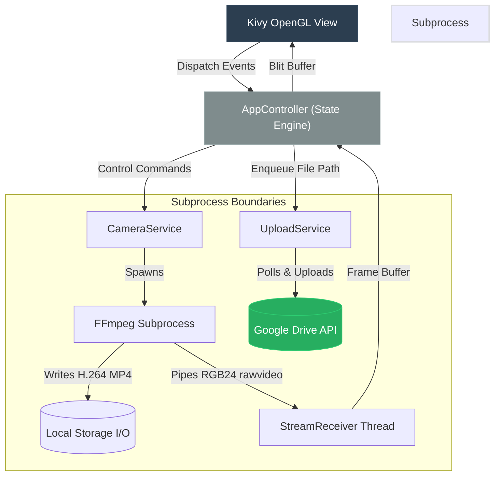

# Universal Camera Controller

A multi-threaded Python framework for hardware-accelerated video acquisition, real-time rendering, and asynchronous cloud storage synchronization. 

This repository implements a decoupled, process-isolated architecture designed to interface with local video devices, capture raw video streams, output to disk, and synchronize media with remote storage without blocking the UI rendering loop.

---

## Technical Design & Architecture

Python's Global Interpreter Lock (GIL) and CPU overhead present significant challenges for real-time video processing and UI rendering. This project mitigates these bottlenecks by offloading high-throughput operations (video encoding and file system I/O) to external subprocesses and background threads.

### Execution Flow



### Core Mechanisms

1. **Subprocess-Level Video Encoding**:
   The `CameraWorker` spawns a dedicated `ffmpeg` subprocess using hardware-accelerated input APIs (e.g., Video4Linux2 on Linux, AVFoundation on macOS). FFmpeg performs dual-muxing:
   - Encodes input stream to H.264 and writes directly to an MP4 container.
   - Pipes raw RGB24 frames to `stdout` for consumption by the application.
   This approach avoids Python-side encoding overhead.

2. **Ring Buffer & Inter-Process Communication (IPC)**:
   The application configures a large stdout buffer (`bufsize=10**8`) to prevent backpressure in the kernel pipe. The `StreamReceiver` reads raw bytes synchronously from the pipe in a background worker thread. When a complete frame is read (determined by `width * height * 3`), it schedules texture updates on the main thread via thread-safe UI scheduling loops (`Clock.schedule_once`).

3. **Asynchronous Upload Pipeline**:
   The `UploadService` maintains a daemonized worker thread that consumes file paths from a thread-safe `queue.Queue`. When a camera stops recording, the controller enqueues the output file path. The upload process runs independently of the video capture and rendering loops, preventing drops in UI framerate when facing network latency.

4. **Service-Oriented Decoupling**:
   - **View Layer**: Handles UI layouts, user interaction events, and OpenGL texture binding.
   - **Controller (Core)**: Encapsulates state synchronization and business rules (e.g. active camera handoffs during a recording session).
   - **Services Layer**: Manages configuration parsing, system subprocess orchestration, and background API requests.

---

## Getting Started

### Prerequisites

- **Python**: 3.11 or higher.
- **Dependency Management**: [uv](https://github.com/astral-sh/uv).
- **System Libraries**: `ffmpeg` binary must be available on the system path.

### Installation

Clone the repository and install project dependencies using `uv`:

```bash
git clone https://github.com/priyanshum17/UniversalCameraController.git
cd UniversalCameraController
uv sync
```

### Run Command

The repository provides a `Makefile` wrapper to start the main GUI application:

```bash
make run
```

### Raspberry Pi Setup

If you are running the application on a Raspberry Pi:
1. Run the system setup script to install necessary GLES, Mesa, SDL2, and FFmpeg dependencies:
   ```bash
   make setup
   ```
2. The setup script will automatically generate:
   - `run_app.sh`: A shell script launcher that exports appropriate environment variables (`KIVY_GL_BACKEND=sdl2`, `KIVY_WINDOW=sdl2`) for Pi hardware-accelerated rendering.
   - `~/Desktop/CameraController.desktop`: A desktop launcher shortcut to run the app directly from the Pi desktop GUI.
3. You can execute the app using either the desktop shortcut or directly from the terminal:
   ```bash
   ./run_app.sh
   ```

---

## Configuration Schema

Settings are resolved via the configuration schema defined in `src/camera_app/config.json`. The framework dynamically selects device drivers based on the host operating system platform.

```json
{
    "cameras": [
        {
            "id": "cam1",
            "name": "Primary Feed",
            "device": "0", 
            "enabled": true,
            "fps": 30,
            "resolution": "1280x720"
        }
    ],
    "recording_dir": "./recordings",
    "upload_enabled": true,
    "selected_camera": "cam1"
}
```

### Parameter Specification
- `device`: Specifies the device index or identifier. On macOS, this is typically an integer index (`"0"`); on Linux, it maps to a device node path (e.g., `"/dev/video0"`).
- `resolution`: Demarcates the video capture width and height. Must correspond to a support mode of the target camera.
- `upload_enabled`: Boolean flag determining whether completed recordings are queued to the background upload worker thread.

---

## License

Distributed under the MIT License. See `LICENSE` for details.
