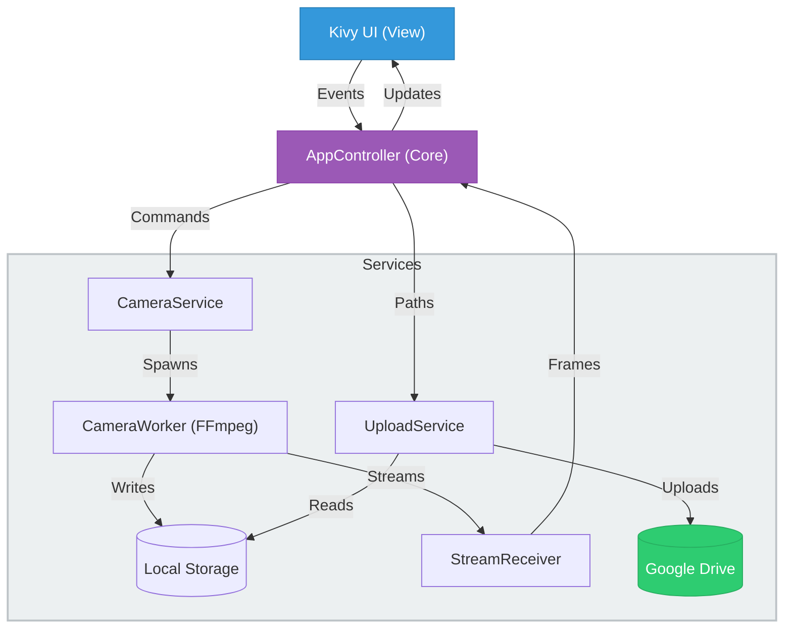

<div align="center">

<!-- Placeholder for Logo -->
# Universal Camera Controller

*A high-performance, event-driven Kivy application for managing, recording, and streaming multiple camera feeds directly to Google Drive.*

[](https://opensource.org/licenses/MIT)
[](https://www.python.org/)
[](https://github.com/astral-sh/ruff)
[](http://makeapullrequest.com)

</div>

---

## Features

- **Zero Python Encoding**: Hardware-accelerated `ffmpeg` (e.g., `avfoundation`, `v4l2`) runs in a separate process. Python never bottlenecks video encoding.
- **Single Capture, Dual Output**: Simultaneously record pristine MP4 footage and pipe low-latency RGB streams to the UI.
- **Non-Blocking Uploads**: Seamlessly pushes completed recordings to Google Drive in the background.
- **Service-Oriented Architecture**: Clean MVC separation means you can easily swap the Kivy UI or add AI Computer Vision services to the pipeline.

## Architecture



## Quick Start

### Prerequisites
- Python 3.11+
- [uv](https://github.com/astral-sh/uv) (Extremely fast Python package manager)
- `ffmpeg` installed on your host system (`brew install ffmpeg` on macOS, `apt install ffmpeg` on Linux).

### Installation

```bash
git clone https://github.com/priyanshum17/UniversalCameraController.git
cd UniversalCameraController
uv sync
```

### Running Locally

```bash
make run
```

## Configuration

Camera settings are stored in `src/camera_app/config.json`. The application supports `avfoundation` (macOS), `v4l2` (Linux/Raspberry Pi), and `dshow` (Windows).

```json
{
    "cameras": [
        {
            "id": "cam1",
            "name": "Front Camera",
            "device": "0", 
            "enabled": true,
            "fps": 30,
            "resolution": "1920x1080"
        }
    ],
    "recording_dir": "./recordings",
    "upload_enabled": true
}
```

## Contributing

Contributions make the open-source community such an amazing place to learn, inspire, and create. Any contributions you make are greatly appreciated.

1. Fork the Project
2. Create your Feature Branch (`git checkout -b feature/AmazingFeature`)
3. Commit your Changes (`git commit -m 'Add some AmazingFeature'`)
4. Push to the Branch (`git push origin feature/AmazingFeature`)
5. Open a Pull Request

## License

Distributed under the MIT License. See `LICENSE` for more information.
